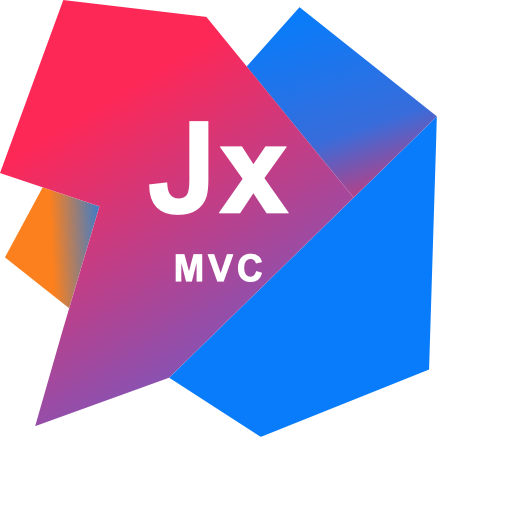

<p align="center">
  
</p>

<!-- ============================================================
     JxMVC · Lux Framework — README oficial
     ============================================================ -->

<div align="center">



# JxMVC — Lux Framework

### Framework MVC para Jakarta EE · JAR de 253 KB · **cero** dependencias externas en runtime

<p>
  <a href="https://jxmvc.ginit.dev"></a>
  
  
  
</p>

<p>
  
  
  
  
  
  
</p>

<p align="center">
  
</p>

</div>

---

## Tabla de contenidos

- [Qué es JxMVC](#qué-es-jxmvc)
- [Sitio oficial](#sitio-oficial)
- [Por qué JxMVC](#por-qué-jxmvc)
- [Características](#características)
- [Inicio rápido](#inicio-rápido)
- [Stack tecnológico](#stack-tecnológico)
- [Arquitectura](#arquitectura)
- [Estructura del repositorio](#estructura-del-repositorio)
- [Requisitos previos](#requisitos-previos)
- [Compilación](#compilación)
- [Configuración](#configuración)
- [Autenticación](#autenticación)
- [Endpoints internos](#endpoints-internos)
- [Comparativa](#comparativa)
- [Pruebas y calidad](#pruebas-y-calidad)
- [Versionado](#versionado)
- [Autores](#autores)
- [Licencia](#licencia)

---

## Qué es JxMVC

**JxMVC** (*Lux Framework*) es un framework **MVC** para **Jakarta EE 10** pensado para
correr sobre **Tomcat 10+** sin arrastrar un solo megabyte de dependencias externas en
tiempo de ejecución. Todo —routing, acceso a datos, pool de conexiones, serializador
JSON, caché, scheduler, WebSocket, métricas— está escrito desde cero dentro del propio
framework. El único requisito adicional en producción es el **driver JDBC** de la base
de datos en uso.

<div align="center">

**routing → controlador → JxDB → JSON**, directo, sin POJOs, sin Lombok, sin reflexión de mapeo.

</div>

El resultado es un **JAR de 253 KB** (frente a los ~20 MB de Spring Boot) que **arranca en
~1.2 s** y expone una API sencilla y explícita. El producto y el código están en **español**.

---

## Sitio oficial

**Sitio y generador de proyectos:** [jxmvc.ginit.dev](https://jxmvc.ginit.dev)

El módulo `JxMVC2x` es a la vez el **sitio oficial** de documentación y un **generador** que
arma un proyecto de arranque listo para descargar.

---

## Por qué JxMVC

```
JAR:      253 KB    vs  Spring Boot 20 MB   →  ~100x más ligero
Arranque: 1.2 s     vs  Spring Boot 4–8 s   →  ~5x más rápido
Deps:     0         vs  cualquier otro      →  único en su clase
```

```java
// No hacemos esto (Spring / Hibernate / Lombok)
@Entity @Table(name = "tbl_personas")
public class Persona {
    @Id @GeneratedValue @Column(name = "id") private Long id;
    @Getter @Setter private String nombre;
}

// Hacemos esto — directo, sin magia
DBRow per   = db.GetRow("tblPersonas", "id = ?", id);
String nom  = per.GetString("Nombres");
int    edad = per.GetInt("Edad");
```

Los campos se leen directamente del `DBRow`. Los modelos usan *views* y cruces definidos
en la BD. **Cero POJOs, cero Lombok, cero mapeo por reflexión.**

---

## Características

| Módulo | Descripción |
|--------|-------------|
| **Routing** | Por convención y anotaciones, variables de ruta `{id}`, pipeline de 15 etapas |
| **JxDB** | JDBC directo — PostgreSQL, MySQL, SQL Server — *named params* `:name` |
| **JxPool** | Pool de conexiones propio — sin HikariCP, sin DBCP |
| **JxRepository** | CRUD genérico con *soft delete*, paginación y `@JxQuery` |
| **JxTransaction** | Transacciones JDBC vía `ThreadLocal` |
| **GenApi** | Builder JSON variádico — `JsonStr`, `JsonArray`, `JsonPaged`, `nested` |
| **JxJson** | Parser / serializer JSON escrito desde cero |
| **JxValidation** | 21 anotaciones — `@JxRequired`, `@JxEmail`, `@JxRange`, `@JxFuture`, `@JxUrl`… |
| **JxCache** | Caché en memoria con TTL, tope de entradas y backend intercambiable |
| **JxScheduler** | Tareas programadas — `@JxScheduled(cron=…)`, `fixedRate`, `fixedDelay`, `runOnce` |
| **JxEventBus** | Bus de eventos síncrono con `@JxEventListener` |
| **JxMetrics** | Métricas por ruta — totales, promedio, mín, máx |
| **JxOpenApi** | Generación automática de spec **OpenAPI 3.0** |
| **JxWebSocket** | Endpoints WS con salas, *broadcast* y `@JxWsEndpoint` |
| **JxRateLimiter** | *Rate limiting* por IP con `@JxRateLimit` — clave por acción, no evadible rotando `{id}` |
| **JxSecurity** | Autenticación y roles enchufables (`JxAuthProvider`) — *fail-closed* sin provider |
| **JxOAuth** | Inicio de sesión con **Google** (OAuth 2.0 + PKCE S256) — construye la URL, intercambia el código y trae los claims, sin librería externa |
| **JxPasswords** | Hashing de contraseñas **PBKDF2-SHA256** con salt y coste embebidos, verificación en tiempo constante |
| **JxCsrf** | Protección CSRF por token de sesión — `jx:csrf` en JSP, `X-CSRF-Token` en fetch, `@JxCsrfExempt` |
| **JxHtml** | Codificación de salida HTML (`jx:esc`) — la defensa XSS en el render |
| **JxDevMode** | *Watcher* de cambios en perfil `dev` |
| **Virtual Threads** | Detección automática Java 21+ para `@JxAsync` |

---

## Inicio rápido

**1. Declara la dependencia**

```xml
<!-- pom.xml -->
<dependency>
    <groupId>jxmvc</groupId>
    <artifactId>jxmvc-core</artifactId>
    <version>3.4.0</version>
</dependency>
```

**2. Escribe un controlador con acceso a BD** — sin POJO, sin Lombok

```java
@JxControllerMapping("api/persona")
public class PersonaController extends JxController {

    @JxGetMapping("{id}")
    public ActionResult get(@JxPathVar String id) {
        PersonaModel db = new PersonaModel();
        DBRow per = db.GetRow("tblPersonas", "id = ?", id);
        if (per == null) return Json(GenApi.Error(404, "No encontrado"));

        return Json(GenApi.JsonStr(
            "id",       per.Get("id"),
            "nombre",   per.GetString("Nombres"),
            "correo",   per.GetString("Correo"),
            "telefono", per.GetString("Telefono")
        ));
    }
}
```

**3. El modelo extiende `JxDB` directamente** — sin repositorios extra

```java
public class PersonaModel extends JxDB {
    public PersonaModel() { super(); }

    public DBRowSet buscarPorApellido(String apellido) {
        return GetTable("tblPersonas", "Apellidos LIKE ?", apellido + "%");
    }
}
```

---

## Stack tecnológico

| Capa | Tecnología |
|------|-----------|
| Lenguaje | **Java 17+** (detecta *Virtual Threads* en Java 21+) |
| Plataforma | **Jakarta EE 10** · **Tomcat 10.1+** |
| Build | **Maven** |
| Base de datos | **PostgreSQL / MySQL / SQL Server** (solo el driver JDBC) |
| Runtime | **0 dependencias externas** |
| Vistas | **JSP** + tags propios `<jx:for>` / `<jx:if>` |

---

## Arquitectura

Pipeline de petición del núcleo (`MainLxServlet`), de 15 etapas:

```
Request
  → BaseSanitizer      limpieza XSS de params y args
  → BaseCorsResolver   política CORS declarativa por anotación
  → BaseDispatcher     router: anotaciones, plantillas {var}, convención /ctrl/action/args
  → JxRateLimiter      rate limiting por IP
  → JxSecurity         autenticación y roles (JxAuthProvider)
  → JxFilters          filtros before/after globales
  → JxController        acción del desarrollador  ── JxDB / JxRepository / JxTransaction
  → JxValidation       validación de @JxBody
  → ActionResult       VIEW | TEXT | JSON | REDIRECT
  → JxGzip             compresión con passthrough por umbral
  → JxMetrics          métricas por ruta
Response
```

El detalle clase por clase está en [`JxMVC.Core/STATUS.md`](JxMVC.Core/STATUS.md).

---

## Estructura del repositorio

```
19.Soft_JXMVC/
├── JxMVC.Core/          Framework — JAR de 253 KB, 54 clases, 0 deps externas
│   ├── src/main/java/jxmvc/core/     núcleo (routing, JxDB, pool, JSON, ws…)
│   ├── src/test/java/jxmvc/core/     347 verificaciones sin framework externo
│   ├── CHANGELOG.md · STATUS.md · build.sh · pom.xml
│
└── JxMVC2x/             Sitio oficial + generador de proyectos (jxmvc.ginit.dev)
    └── src/main/…       controllers, vistas JSP, assets
```

---

## Requisitos previos

- **JDK 17** o superior
- **Apache Maven 3.9+**
- **Apache Tomcat 10.1+** (para desplegar el módulo web)
- Un **driver JDBC** de tu base de datos (PostgreSQL / MySQL / SQL Server)

---

## Compilación

```bash
# Framework core (genera el JAR y corre las 347 verificaciones)
cd JxMVC.Core
mvn clean package
# → target/jxmvc-core-3.4.0.jar

# Sitio oficial / generador (genera el WAR)
cd ../JxMVC2x
mvn clean package
# → target/*.war  (desplegar en Tomcat 10.1+)
```

---

## Configuración

```properties
# application.properties
jxmvc.db.url  = jdbc:postgresql://localhost:5432/miapp
jxmvc.db.user = usuario
jxmvc.db.pass = secreto
jxmvc.profile = dev        # dev | prod | test

# También por variables de entorno: DB_URL, DB_USER, DB_PASS
```

Propiedades de *hardening* para producción (v3.4.0):

```properties
jxmvc.pool.validationInterval = 30       # seg sin revalidar la conexión (0 = siempre)
jxmvc.cache.maxEntries        = 10000    # tope por caché nominada (0 = sin límite)
jxmvc.gzip.maxBytes           = 1048576  # umbral de passthrough sin compresión
jxmvc.internal.expose         = false    # exponer /jx/* internos en prod
jxmvc.security.csp            =          # Content-Security-Policy (vacío = sin header)
jxmvc.security.csrf           = false    # protección CSRF por token de sesión
jxmvc.body.maxBytes           = 10485760 # tope del body no-multipart (413 al exceder)
jxmvc.redirect.external       = false    # permitir redirecciones a otros dominios
jxmvc.trustProxy              = false    # confiar en X-Forwarded-For (solo tras proxy propio)
jxmvc.ws.maxConnections       = 0        # tope global de conexiones WebSocket
```

---

## Autenticación

JxMVC trae de fábrica inicio de sesión con **Google** (OAuth 2.0 + PKCE) y **hashing de
contraseñas** para el login nativo — ambos sin dependencias externas. Están en el core
(`jxmvc.core.JxOAuth`, `jxmvc.core.JxPasswords`) y funcionan en vivo en
[jxmvc.ginit.dev/auth/login](https://jxmvc.ginit.dev/auth/login).

### Login con Google (OAuth 2.0 + PKCE)

Configura las credenciales (nunca en el código — usa variables de entorno):

```properties
jxmvc.oauth.google.client-id     = xxxxx.apps.googleusercontent.com   # env JXMVC_OAUTH_GOOGLE_CLIENT_ID
jxmvc.oauth.google.client-secret = xxxxx                              # env JXMVC_OAUTH_GOOGLE_CLIENT_SECRET
jxmvc.oauth.google.redirect-uri  = https://tu-app/auth/google/callback
```

En el controlador, dos pasos:

```java
// 1) Redirigir al consentimiento de Google (genera state anti-CSRF y verificador PKCE)
@JxGetMapping("google")
public ActionResult google() {
    JxOAuth.Flow flow = JxOAuth.google().start();
    sessionSet("oauth.state",    flow.state());
    sessionSet("oauth.verifier", flow.codeVerifier());
    view.status(302);
    view.header("Location", flow.url());   // URL absoluta al proveedor
    return text("");
}

// 2) Callback: valida el state, intercambia el código y crea la sesión
@JxGetMapping("google/callback")
public ActionResult googleCallback() {
    if (!model.param("state").equals(sessionGet("oauth.state")))
        throw JxException.forbidden("state inválido");
    JxOAuth.User user = JxOAuth.google()
            .login(model.param("code"), (String) sessionGet("oauth.verifier"));
    sessionSet("user", user);   // user.email(), user.name(), user.picture()…
    return redirect("/auth/perfil");
}
```

### Login nativo (correo + contraseña)

```java
// Al registrar: guarda el hash, nunca la contraseña en claro
String stored = JxPasswords.hash("s3cr3t!");

// Al iniciar sesión: verificación en tiempo constante
if (JxPasswords.verify(inputPassword, stored)) {
    sessionSet("user", user);
}
```

Rutas protegidas con `@JxRequireAuth` / `@JxRequireRole` — el core valida la sesión
mediante el `JxAuthProvider` que registres (ver `JxSecurity.setProvider`).

---

## Endpoints internos

```
GET /jx/health    → {"status":"UP","version":"3.4.0","pool":{…},"ws":{…}}
GET /jx/info      → {"framework":"JxMVC","java":"17","server":"Tomcat/10.1"}
GET /jx/metrics   → métricas por ruta
GET /jx/openapi   → spec OpenAPI 3.0 generada automáticamente
```

> En perfil `prod`, `/jx/info`, `/jx/metrics` y `/jx/openapi` responden **404** salvo que
> se active `jxmvc.internal.expose=true`. `/jx/health` sigue disponible pero omite datos
> sensibles (`version`, `profile`, `devMode`).

---

## Comparativa

| | **JxMVC 3.4.0** | Spring Boot 3 | Micronaut 4 | Quarkus 3 | Javalin 6 |
|---|---|---|---|---|---|
| JAR runtime | **253 KB** | ~20 MB | ~25 MB | ~15 MB | ~1.5 MB |
| Deps externas | **0** | 200+ | 50+ | 80+ | 10+ |
| Arranque | **1.2 s** | 4–8 s | 0.3 s | 0.3 s | 0.5 s |
| JSON propio | **Sí** | No | No | No | No |
| Pool propio | **Sí** | No | No | No | No |
| Scheduler propio | **Sí** | No | No | No | No |

> **Nota honesta sobre el tamaño.** Los 253 KB son el **JAR del framework** (sin dependencias
> empaquetadas): en despliegue corre sobre un servlet container (Tomcat/Jakarta EE, ~15 MB) que
> queda fuera del artefacto por ser `provided`. Los ~20 MB de Spring Boot son un *uber-JAR* que
> **incluye** su servidor embebido. La comparación justa "framework + servidor" y las cifras de
> arranque/latencia/memoria se reportan con metodología reproducible en [`benchmarks/`](benchmarks/).

---

## Pruebas y calidad

- **347 verificaciones** en `JxMVC.Core/src/test/`, escritas **sin framework de testing externo**.
- Cobertura de los caminos críticos de producción: pool bajo concurrencia (50 threads),
  gzip con *passthrough*, *stampede* de caché, *broadcast* WebSocket concurrente,
  escape de errores JSON, *path traversal* y *mass assignment*.

```bash
cd JxMVC.Core
mvn test
```

El historial de auditorías de producción está en [`JxMVC.Core/CHANGELOG.md`](JxMVC.Core/CHANGELOG.md).

---

## Versionado

Este proyecto sigue **[SemVer](https://semver.org/lang/es/)**. La versión actual es
**3.4.0** (inicio de sesión con **Google** vía OAuth 2.0 + PKCE y hashing de contraseñas
PBKDF2 integrados en el core, ambos sin dependencias externas; API pública intacta). Ver el
[CHANGELOG](JxMVC.Core/CHANGELOG.md) para el detalle.

---

## Autores

- **Dr. Ramiro Pedro Laura Murillo** — Diseño y arquitectura principal
- **R. Andre Vilca Solorzano** — Contribuciones v3.x · [andre.net.pe](https://andre.net.pe) · [night.fury.oi.ma@gmail.com](mailto:night.fury.oi.ma@gmail.com)

<sub>Proyecto independiente de código abierto · 2024–2026</sub>

---

## Licencia

Distribuido bajo licencia **MIT**. Puedes usar, copiar, modificar y distribuir el
software libremente conservando el aviso de copyright.

<p align="center">
  
</p>
